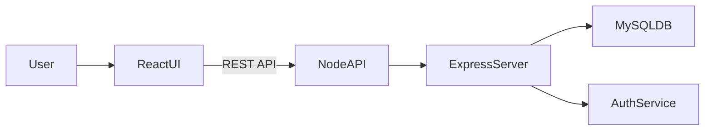
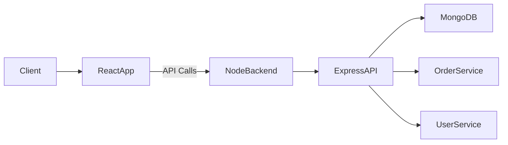

# ☁️ Anurag Choudhary   
### Full-Stack Developer • Cloud & DevOps Fundamentals  

  
  
  

  

---

## 📊 Real-Time GitHub Statistics

### 🔥 Contribution Metrics

### 💻 Language Distribution

### 🏆 GitHub Trophies

### 📈 Contribution Badges

  
  
  
  

### 🛠️ Primary Languages

  
  
  
  
  
  
  

### 🌟 2026 Activity Overview

**Location:** 📍 Indore, India  
**GitHub Member Since:** 2 years  
**Active Contributor:** Contributing to open-source projects and building full-stack applications

---

## 🚀 About Me

I'm a **Full-Stack Developer** with hands-on experience building **MERN stack applications** and a growing foundation in **Cloud & DevOps**.  
I focus on writing **clean, maintainable code** while understanding how applications are **deployed, configured, and scaled** in real environments.

I enjoy working across the **development → deployment lifecycle**, strengthening my skills in **C++**, **Data Structures & Algorithms**, backend APIs, and cloud fundamentals. 

---

## 🧠 Core Skills (DevOps-Aligned)

### 💻 Application Development
- JavaScript, C++, Java  
- React.js, Node.js, Express.js  
- RESTful APIs, MVC Architecture  

### 🗄️ Databases
- MongoDB  
- MySQL  

### ☁️ Cloud & DevOps Fundamentals
- AWS Basics (EC2, S3 — concepts & hands-on exposure)  
- Linux Fundamentals (filesystem, processes, permissions)  
- CI/CD Concepts  
- Environment configuration & deployment flow  

### 🛠️ Tools & Practices
- Git, GitHub, VS Code  
- Agile & SDLC  

---

## ☁️ System Architecture Mindset

I design applications with:
- Clear **frontend–backend separation**
- **API-driven** communication
- **Modular backend** structure
- **Cloud-ready thinking** (stateless services, config separation)

---

## 🏗️ Projects & Architecture

### 🤝 Volunteer Opportunity & Resource Exchange Platform
**Full-Stack MERN Application**

**Problem**  
NGOs struggle to efficiently connect with volunteers.

**Solution**  
A full-stack platform enabling volunteer registration, opportunity posting, and API-based interactions.

**Tech Stack**  
React.js • Node.js • Express.js • MySQL  

**Architecture**

**Engineering Focus**
- RESTful API design
- Authentication & CRUD operations
- Separation of concerns
- Scalable backend structure

---

### 🍔 Online Food Delivery System (College Minor Project)
**Full-Stack MERN Application**

**Problem**  
Managing menus, orders, and users efficiently.

**Solution**  
A modular food ordering system with structured APIs and optimized database design.

**Tech Stack**  
MongoDB • Express.js • React.js • Node.js

**Architecture**

**Engineering Focus**
- Backend API structuring
- Database schema design
- Modular services
- Clean request–response flow

---

## 🌟 Recent Open Source Contributions

### Active Pull Requests

#### [digitomize/digitomize](https://github.com/digitomize/digitomize) 
Contributing to a platform that aggregates coding contests and competitive programming events.

**Recent PRs:**
- 🎨 **[#1110 - Add global neon scrollbar styling](https://github.com/digitomize/digitomize/pull/1110)** 
  - Implemented modern scrollbar with gradient effects and hover animations
  - Enhanced visual polish with Digitomize brand palette
  
- 📱 **[#1109 - Improve profile page responsiveness](https://github.com/digitomize/digitomize/pull/1109)**
  - Enhanced responsive layout with flexible max-width constraints
  - Better adaptability across mobile, tablet, and desktop screens

- 🔍 **[#1108 - Add query-based contest filtering](https://github.com/digitomize/digitomize/pull/1108)**
  - Implemented platform query parameter for contest filtering
  - Added URL synchronization for shareable filter states
  - Maintained backward compatibility with legacy parameters

- 🎯 **[#1107 - Add colorful terminal logs](https://github.com/digitomize/digitomize/pull/1107)**
  - Enhanced backend logging with color-coded console output
  - Improved developer experience with visual status indicators

**Tech Stack:** React.js, Node.js, Express.js, MongoDB, Tailwind CSS

---

## 💼 Experience

### Frontend Development Intern — CipherByte Technologies
**Aug 2023 – Sep 2023**

- Developed responsive web interfaces using HTML, CSS, and JavaScript
- Built reusable UI components following Agile practices
- Debugged UI issues and improved performance
- Used Git/GitHub for version control and collaboration

---

## 🏆 Achievements & Certifications

- ⭐ **GeeksforGeeks** — 3-Star Coder in C++ (Rating: 1669)
- 💡 **LeetCode** — Solved 100+ problems
- ☁️ **AWS Academy Graduate** — Cloud Architecting
- 🔐 **Cisco** — Introduction to Cybersecurity

---

## 📊 Detailed GitHub Activity

---

## 🎯 Career Focus

- Junior Software Engineer
- Full-Stack Developer
- Cloud / DevOps Intern
- Backend Engineer (Entry-Level)

Currently building cloud-native skills and learning real-world deployment workflows.

---

## 📫 Let's Connect

- 💼 **LinkedIn**:  [Anurag Choudhary](https://www.linkedin.com/in/anurag-choudhary-4291a228a/)
- 📧 **Email**: anuragchoudhary603@gmail.com
- 🐙 **GitHub**: [@anuragchoudhary2313](https://github.com/anuragchoudhary2313)

---

### 💖 Support My Work

⭐ **If you like my work, consider giving a star to my repositories!**

